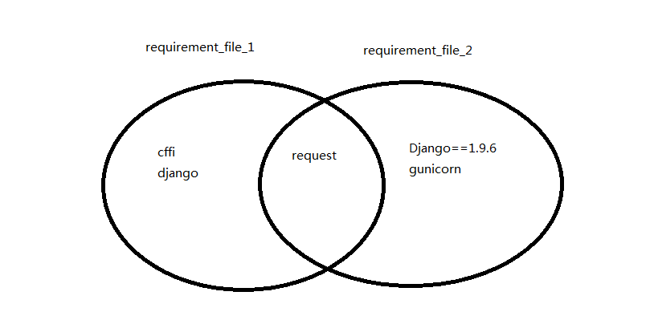

# pip-pop学习笔记

开源代码作者：[Kenneth Reitz](https://www.kennethreitz.org/)

## 简介
Python项目中必须包含一个 requirements.txt 文件，用于记录所有依赖包及其精确的版本号。以便新环境部署。也正是因此，平时需要处理很多requirements.txt文件，令人烦恼。所以K神就自己搞了这个小工具。目前为止， pip-pop提交了41个commit, 看来学习会稍微简单一些。

该库包含两个小工具：pip-diff 和 pip-grep

其中pip-diff用于判断两个requirements文件中哪些依赖包是fresh,哪些是stale的。 

* 用图形化表示为：

则：

fresh requirement_file_1  requirement_file_2 的结果为：

Django==1.9.6

gunicorn

stale requirement_file_1  requirement_file_2 的结果为：

cffi

django

* 文件目录

|=======bin

&emsp;　|___ pip-diff.py  : 比较给定的两个requirements文件的不同，列出 stale or fresh packages.

&emsp;　|___ pip-grep.py  : 在给定的一个requirements文件中，搜索指定的package

|=======tests

&emsp;　|___ test-requirements.txt   用于测试的requirements文件

&emsp;　|___ test-requirements2.txt  用于测试的requirements文件

| .gitignore :github过滤的配置文件

| .travis.yml：持续集成travis的配置文件

| LICENSE

| README.rst

| requirements.txt

| setup.py ：打包工具

| tox.ini ：openstack的测试工具配置文件

## 开发历程

 * Jul 23, 2014（第一天）：主要是初始化工程，包括License文件， Readme，requirement,setup.py等文件。从这一开发过程来看，还是属于RDD（Readme Driven Develop)方法. 而这与公司推行的敏捷开发方法大体相同。不过Github中的项目文档要求更加简洁化。另外markdown是写文档的利器。

 * Jul 25, 2014：pip-diff工具开发完毕，后又经过部分修改，在Jul 30, 完成diff工具。

 * Aug 1, 2014 ~ Aug 22, 2014: 完成pip-grep，至此第一个v0.1.0版本完成。

 * 后续每年也就只有3或5个更新，版本变化不大，毕竟此库相对比较简单。

## 代码剖析
注：删除部分代码，便于理清代码结构
### pip-diff
* 核心类：

        class Requirements(object):
        
        def __init__(self, reqfile=None):
            super(Requirements, self).__init__()
            self.path = reqfile
            self.requirements = []

            if reqfile:
                self.load(reqfile)

        def load(self, reqfile):
            """ 主要是获得该requirement文件中的依赖包， 注意不统计被注释的行"""
            if not os.path.exists(reqfile):
                raise ValueError('The given requirements file does not exist.')

            with open(reqfile) as f:
                data = []

                for line in f:
                    line = line.strip()

                    # Skip lines that start with any comment/control charecters.
                    if not any([line.startswith(p) for p in IGNORABLE_LINES]):
                        data.append(line)

                for requirement in parse_requirements(data):
                    self.requirements.append(requirement)

        def diff(self, requirements, ignore_versions=False):
            """ 统计出两个requirements文件的 fresh及stale依赖包"""
            r1 = self
            r2 = requirements
            results = {'fresh': [], 'stale': []}

            # Generate fresh packages.
            other_reqs = (
                [r.project_name for r in r1.requirements]
                if ignore_versions else r1.requirements
            )

            for req in r2.requirements:
                r = req.project_name if ignore_versions else req

                if r not in other_reqs:
                    results['fresh'].append(req)

            # Generate stale packages.
            other_reqs = (
                [r.project_name for r in r2.requirements]
                if ignore_versions else r2.requirements
            )

            for req in r1.requirements:
                r = req.project_name if ignore_versions else req

                if r not in other_reqs:
                    results['stale'].append(req)

            return results

* 对外接口：

    提供diff接口，注意该接口与Requirements类中的接口名相同。PS: 不知道为何这样命名？

        def diff(r1, r2, include_fresh=False, include_stale=False):
            try:
                r1 = Requirements(r1)
                r2 = Requirements(r2)
            except ValueError:
                print 'There was a problem loading the given requirements files.'
                exit(os.EX_NOINPUT)

            results = r1.diff(r2)
            print results

* 使用方法：

        kwargs = {
            'r1': args['<reqfile1>'],
            'r2': args['<reqfile2>'],
            'include_fresh': args['--fresh'],
            'include_stale': args['--stale']
        }

        diff(**kwargs)

### pip-grep
* 核心类：

        class Requirements(object):
            def __init__(self, reqfile=None):
                super(Requirements, self).__init__()
                self.path = reqfile
                self.requirements = []

                if reqfile:
                    self.load(reqfile)

            def __repr__(self):
                return '<Requirements \'{}\'>'.format(self.path)

            def load(self, reqfile):
                if not os.path.exists(reqfile):
                    raise ValueError('The given requirements file does not exist.')

                finder = PackageFinder([], [], session=requests)
                for requirement in parse_requirements(reqfile, finder=finder, session=requests):
                    if requirement.req:
                        if not getattr(requirement.req, 'name', None):
                            # Prior to pip 8.1.2 the attribute `name` did not exist.
                            requirement.req.name = requirement.req.project_name
                        self.requirements.append(requirement.req)

* 对外接口：

        def grep(reqfile, packages, silent=False):
            try:
                r = Requirements(reqfile)
            except ValueError:
                if not silent:
                    print('There was a problem loading the given requirement file.')
                exit(os.EX_NOINPUT)

            for req in r.requirements:
                if req.name in packages:
                    if not silent:
                        print('Package {} found!'.format(req.name))
                    exit(0)

            if not silent:
                print('Not found.')

            exit(1)

* 使用方法：

        kwargs = {'reqfile': args['<reqfile>'], 'packages': args['<package>'], 'silent': args['-s']}

        grep(**kwargs)

## 新知识点

### super
参考：[调用父类方法](http://python3-cookbook.readthedocs.io/zh_CN/latest/c08/p07_calling_method_on_parent_class.html)

### format 
PS: 内容节选自 http://www.jb51.net/article/63672.htm

自python2.6开始，新增了一种格式化字符串的函数str.format()，

语法：通过{}和:来代替%。 “映射”示例

* 通过位置

        In [1]: '{0},{1}'.format('kzc',18) 
        Out[1]: 'kzc,18'
        In [2]: '{},{}'.format('kzc',18) 
        Out[2]: 'kzc,18'
        In [3]: '{1},{0},{1}'.format('kzc',18) 
        Out[3]: '18,kzc,18'
    

字符串的format函数可以接受不限个参数，位置可以不按顺序，可以不用或者用多次，不过2.6不能为空{}，2.7才可以。
* 通过关键字参数

        In [5]: '{name},{age}'.format(age=18,name='kzc') 
        Out[5]: 'kzc,18'
    

* 通过对象属性

        class Person: 
        def __init__(self,name,age): 
            self.name,self.age = name,age 
            def __str__(self): 
            return 'This guy is {self.name},is {self.age} old'.format(self=self) 
        
        In [2]: str(Person('kzc',18)) 
        Out[2]: 'This guy is kzc,is 18 old'
        

* 通过下标

        In [7]: p=['kzc',18]
        In [8]: '{0[0]},{0[1]}'.format(p)
        Out[8]: 'kzc,18'
        

有了这些便捷的“映射”方式，我们就有了偷懒利器。基本的python知识告诉我们，list和tuple可以通过“打散”成普通参数给函数，而dict可以打散成关键字参数给函数（通过和*）。所以可以轻松的传个list/tuple/dict给format函数。非常灵活。
格式限定符

它有着丰富的的“格式限定符”（语法是{}中带:号），比如：

填充与对齐
填充常跟对齐一起使用
^、<、>分别是居中、左对齐、右对齐，后面带宽度
:号后面带填充的字符，只能是一个字符，不指定的话默认是用空格填充
 比如
    
    In [15]: '{:>8}'.format('189')
    Out[15]: '   189'
    In [16]: '{:0>8}'.format('189')
    Out[16]: '00000189'
    In [17]: '{:a>8}'.format('189')
    Out[17]: 'aaaaa189'
    

精度与类型f
精度常跟类型f一起使用

    In [44]: '{:.2f}'.format(321.33345)
    Out[44]: '321.33'
    

其中.2表示长度为2的精度，f表示float类型。

其他类型
主要就是进制了，b、d、o、x分别是二进制、十进制、八进制、十六进制。

    In [54]: '{:b}'.format(17)
    Out[54]: '10001'
    In [55]: '{:d}'.format(17)
    Out[55]: '17'
    In [56]: '{:o}'.format(17)
    Out[56]: '21'
    In [57]: '{:x}'.format(17)
    Out[57]: '11'
    

用，号还能用来做金额的千位分隔符。

    
    In [47]: '{:,}'.format(1234567890)
    Out[47]: '1,234,567,890'
    

### docopt
项目地址：https://github.com/docopt/docopt.git
以下内容来源于docopt的README.rst

* docopt creates beautiful command-line interfaces。

* The basic idea is that **a good help message has all necessary information in it to make a parser.**

* API

        from docopt import docopt
        docopt(doc, argv=None, help=True, version=None, options_first=False)
        docopt takes 1 required and 4 optional arguments:

1. **doc** could be a module docstring (\_\_doc\_\_) or some other string that contains a help message that will be parsed to create the option parser. The simple rules of how to write such a help message are given in next sections. Here is a quick example of such a string:

        """Usage: my_program.py [-hso FILE] [--quiet | --verbose] [INPUT ...]

        -h --help    show this
        -s --sorted  sorted output
        -o FILE      specify output file [default: ./test.txt]
        --quiet      print less text
        --verbose    print more text

        """
2. **argv** is an optional argument vector; by default docopt uses the argument vector passed to your program (sys.argv[1:]). Alternatively you can supply a list of strings like ['--verbose', '-o', 'hai.txt'].

3. **help**, by default True, specifies whether the parser should automatically print the help message (supplied as doc) and terminate, in case -h or --help option is encountered (options should exist in usage pattern, more on that below). If you want to handle -h or --help options manually (as other options), set help=False.

4. **version**, by default None, is an optional argument that specifies the version of your program. If supplied, then, (assuming --version option is mentioned in usage pattern) when parser encounters the --version option, it will print the supplied version and terminate. version could be any printable object, but most likely a string, e.g. "2.1.0rc1".

        Note, when docopt is set to automatically handle -h, --help and --version
        options, you still need to mention them in usage pattern for this to work.
        Also, for your users to know about them.

5. **options_first**, by default False. If set to True will disallow mixing options and positional argument. I.e. after first positional argument, all arguments will be interpreted as positional even if the look like options. This can be used for strict compatibility with POSIX, or if you want to dispatch your arguments to other programs.

### kwargs使用
*args: Non-keyword variable arguments 表示没有key值

**kwargs：keyword variable arguments  表示带有key值

主要用于不定参的函数调用，如下代码：

        def func_var_args(farg, *args):
            print 'arg:', farg
            for value in args:
                print 'another arg:', value

        def func_var_kwargs(farg, **kwargs):
            print 'arg:', farg
            for key in kwargs:
                print 'another pair arg [%s: %s]' %(key, kwargs[key])

        if __name__ == '__main__':
            func_var_args(1, 'two', 3) # 'two', 3被存在在了args中

            print '========================================'
            func_var_kwargs(farg=1, myarg2='two', myarg3=3) # myarg2='two', myarg3=3被存在kwargs中
            print '========================================'
            
            #不带参数也是可以的
            func_var_args(1)
            print '========================================'
            func_var_kwargs(2)

### __repr__使用
        __str__()用于显示给用户，而__repr__()用于显示给开发人员。
### setup.py打包工具
setup工具可以实现将依赖包与软件一起打包发布，并在目标机器上，使用python set_up.py install安装。

如 pip-pop库中的示例：

    """
    pip-pop manages your requirements files.
    """
    import sys
    from setuptools import setup

    setup(
        name='pip-pop',
        version='0.1.0',
        url='https://github.com/kennethreitz/pip-pop',
        license='MIT',
        author='Kenneth Reitz',
        author_email='me@kennethreitz.org',
        description=__doc__.strip('\n'),
        #packages=[],
        scripts=['bin/pip-diff', 'bin/pip-grep'],
        #include_package_data=True,
        zip_safe=False,
        platforms='any',
        install_requires=['docopt', 'pip>=1.5.0'],
        tests_require=['tox'],
        classifiers=[
            # As from https://pypi.python.org/pypi?%3Aaction=list_classifiers
            #'Development Status :: 1 - Planning',
            #'Development Status :: 2 - Pre-Alpha',
            #'Development Status :: 3 - Alpha',
            'Development Status :: 4 - Beta',
            #'Development Status :: 5 - Production/Stable',
            #'Development Status :: 6 - Mature',
            #'Development Status :: 7 - Inactive',
            'Programming Language :: Python',
            'Programming Language :: Python :: 2',
            'Programming Language :: Python :: 2.7',
            'Programming Language :: Python :: 3',
            'Programming Language :: Python :: 3.4',
            'Programming Language :: Python :: 3.5',
            'Programming Language :: Python :: Implementation :: CPython',
            'Programming Language :: Python :: Implementation :: PyPy',
            'Intended Audience :: Developers',
            'Intended Audience :: System Administrators',
            'License :: OSI Approved :: BSD License',
            'Operating System :: OS Independent',
            'Topic :: System :: Systems Administration',
        ]
    )